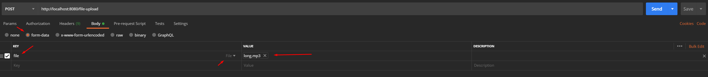
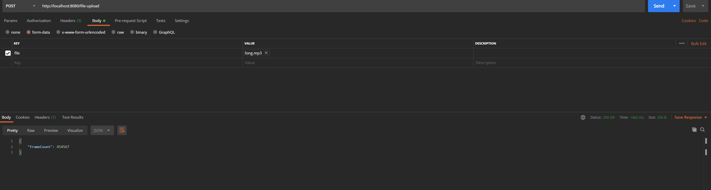
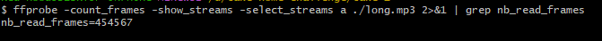

# MP3 Frame Counter
A TypeScript endpoint that accepts an MP3 file and returns the number of MPEG-1 Layer III audio frames it contains. I used [Data Voyage](https://www.datavoyage.com/mpgscript/mpeghdr.htm) and [ID3](https://id3.org) for understanding the frame header layout and how ID3v1/ID3v2 tags affect parsing.

## Installation
Clone the repository and run `npm i` in the root directory to install the dependencies.

## Set Up
By default the app will run on port `3000`. If you'd like to use a different port, create an env file based on [env.example](.env.example) and choose whatever port you'd like.

## Running The Server
To run the server locally you can use `npm run dev` or `npm start`

## How To Use
Open your preferred api testing tool and create a new post request.
- The url should be `http://localhost:{yourPortHere}/file-upload`
- Your body should have form-data selected
- The key should be `file`, and the type of file should be selected 
- Upload your desired mp3 file in the value
- If you'd like to see some debug logs, you can pass the query param `debug=true` I.E `http://localhost:{yourPortHere}/file-upload?debug=true`

### Postman Set Up Example

### Postman Response Example

## Verify
I used ffprobe to verify the frame count of multiple files. The below is an example of the same file used in postman requests screen shots  
